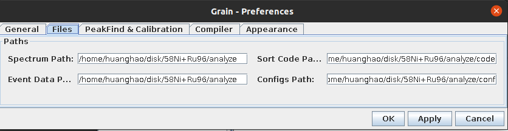

[Grain](https://trac.cc.jyu.fi/projects/grain) - A Java data analysis system for Total Data Readout

# Install

  
  - 1. [Download](./Grain-code)
  - 2. Decompress
    - tar -xvjf grain-1.0.tgz
  - 3. Set Environment
    - 1. Java environment 
    - 2. Grain evnironment (Setting -> Preference) 
      - Correct paths to javac compiler(Javac Path) and the location of grain.jar (!!!Not grain.sh)
      
      
      - Correct File Path
      
  - 4. Compile the java code (Edit sort)
  

  

# Ref
  - [[1] P. Rahkila, Nucl. Instrum. Methods Phys. Res., Sect. A, Accel. Spectrom. Detect.
Assoc. Equip. 595 (3) (2008) 637–642.](./Ref/Grain—A_Java_data_analysis_system_for_Total_Data_Readout.pdf)
